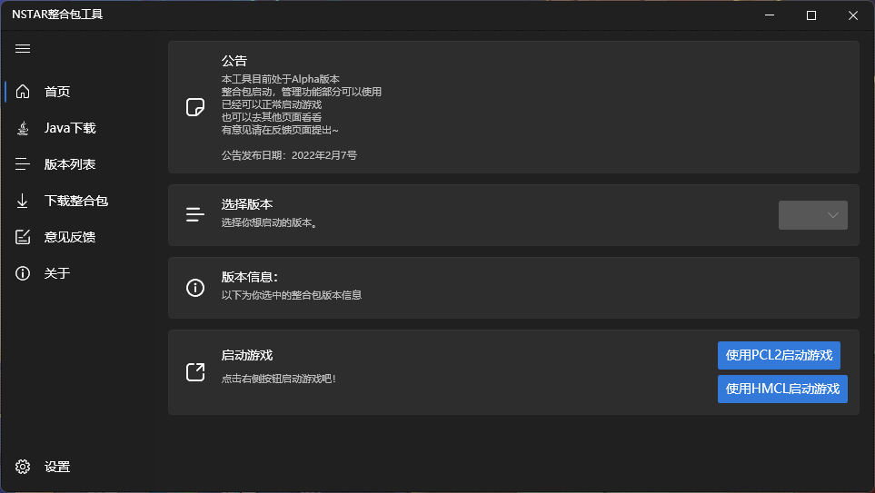

# NSTARMC-Tools

<<<<<<< HEAD
## ~~注意：程序由于使用了一些外接API的Token，Token务必保密，所以从V1.6.1起，程序将闭源。本仓库源码为V1.6.0版本源码，日后仅作为release版本使用，源码不再更新！~~  

  

## 注意：程序由于使用了一些外接API的Token，Token务必保密，所以从V1.6.4起，程序的部分模块将不会上传，则你无法直接将本项目编译（删掉那些函数调用就行），仅V1.6可以直接编译。
=======
## 注意：程序由于使用了一些外接API的Token，Token务必保密，所以从V1.6.1起，程序将闭源。本仓库源码为V1.6.0版本源码，日后仅作为release版本使用，源码不再更新！
>>>>>>> 22a8a67ac67b2d0e2a30439db833dbddcfe36e05

## 赞助

你可以通过以下网站赞助

[https://afdian.net/@xiaoyululu](https://afdian.net/@xiaoyululu)

## 简介

具体看：[NSTARMC-Tools Docs | NSTARMC-Tools Docs](https://packs.nstarmc.cn/)

### 开篇

本工具是为NSTAR系列（基础）模组整合包准备的一个管理工具，更加方便使用。  

整合包原帖：[[1.18.1—1.7.10\]NSTAR（夜阑星空）基础模组整合包（含光影） - 整合包发布 - Minecraft(我的世界)中文论坛 - (mcbbs.net)](https://www.mcbbs.net/thread-1025346-1-1.html)。  

开源目的是更方便管理版本，已预防有些人说有病毒。  

### 功能，UI介绍

本工具基于**Windows10/11** 进行开发，对于Window7版本支持不太好，建议改用Windows10/11版本的操作系统。  

UI仿照了Windows11 的UI界面。  

虽然现在看着只是整合包套壳，但会推出更多功能，详见工具内-”关于“选项卡-”未来更新计划“。

## 开发环境

### 软件环境

Visual Studio 2022

### 语言

Visual Basic .Net

(.Net Framework4.8)

### 使用的NugetPackage

- WPF-UI
- Modernwpfui
- Webview2
- dotnetCampus.FileDownloader
